# TraceData ML Pipeline: A Ground-Level Technical Guide

> **For:** Engineers familiar with software systems who are new to ML, MLOps, and production deployment.
> **Goal:** Map every ML concept to a concrete file or function in this codebase.

---

## 🗺️ The Big Picture

The entire system is an **ML-powered Factory Line**: raw sensor data goes in, and an intelligent driver coaching report comes out. Here is everything, end to end:

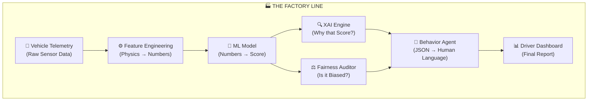

---

## Stage 1: Data — Where It All Begins

### What is Telemetry?
Telemetry is a time-series stream of raw sensor readings from a moving vehicle. Each packet contains a timestamp, GPS coordinate, speed, and acceleration.

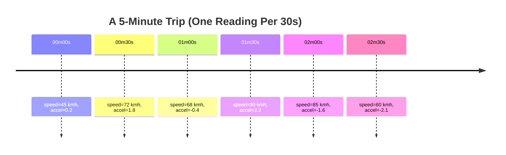

### The Database Schema
We store this time-series in a **Row-Oriented** schema (ADR 001). Each GPS reading is one database row — not a JSON blob.

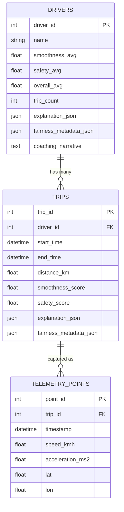

---

## Stage 2: Feature Engineering — Translating Physics into Numbers

This is the **most important and most human** step in ML. The model cannot understand "jerky driving" — it only sees columns of numbers. Feature Engineering is the act of encoding your domain knowledge into those columns.

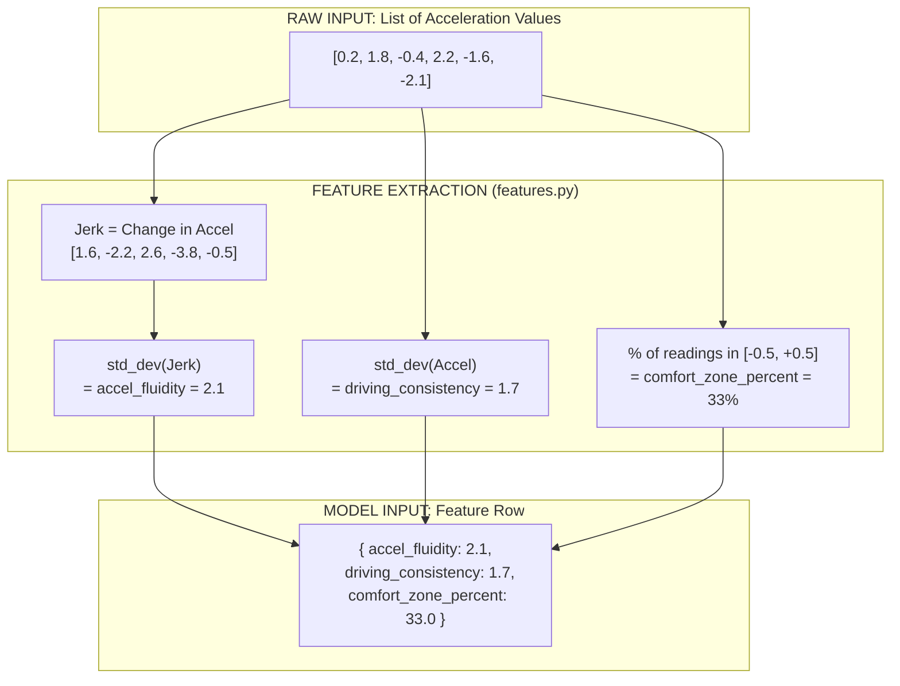

### Intuition Behind Each Feature

| Feature | Formula | Low Value Means | High Value Means |
| :--- | :--- | :--- | :--- |
| **`accel_fluidity`** | `std_dev(Δ acceleration)` | Smooth, gradual transitions | Jerky, sudden changes |
| **`driving_consistency`** | `std_dev(acceleration)` | Predictable, steady pace | Erratic, unpredictable |
| **`comfort_zone_percent`** | `% where |accel| ≤ 0.5` | Rarely in comfort zone | Nearly always gentle |

> **Key Insight:** The model sees these 3 numbers, not GPS coordinates or timestamps. You are the translator between physics and mathematics.

---

## Stage 3: ML Training — Teaching the Model to Score

Training happens **offline, once** (or periodically). It produces a `.joblib` artifact that is then used at runtime.

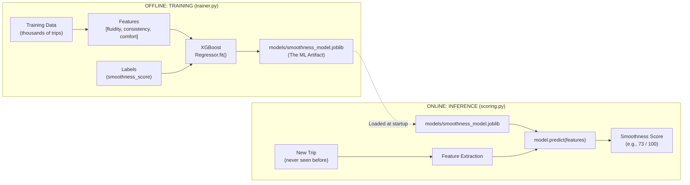

### The Training Loop (Simplified)

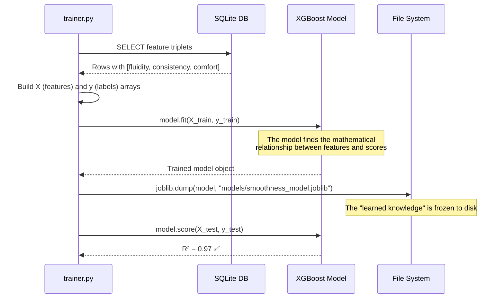

---

## Stage 4: Inference — Scoring a New Trip at Runtime

"Inference" = using the trained model to generate predictions on **new, unseen data**.

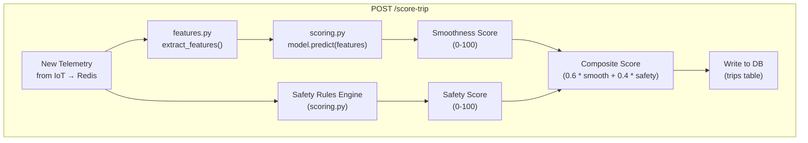

### Why Hybrid? ML + Rules?

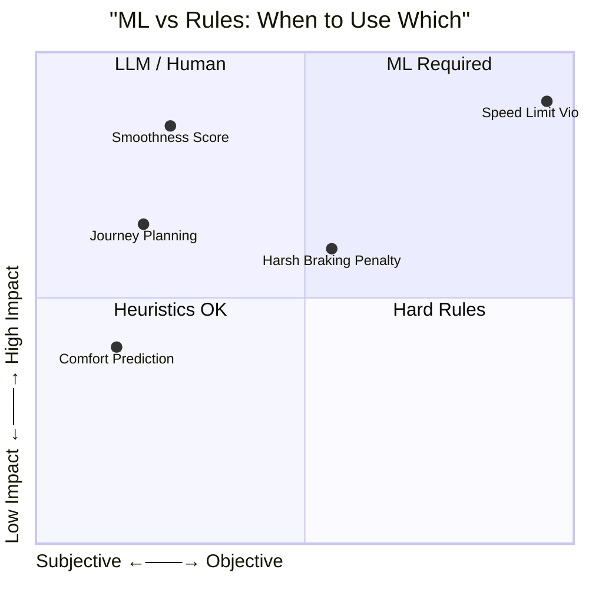

Speeding is **objective** (you either exceeded the limit or you didn't). You don't need ML to detect it — you need a rule. Smoothness is **subjective** (what feels smooth to one person differs from another). That's where ML shines.

---

## Stage 5: Explainability (XAI) — Opening the Black Box

XGBoost is a black box. SHAP reverse-engineers its decisions.

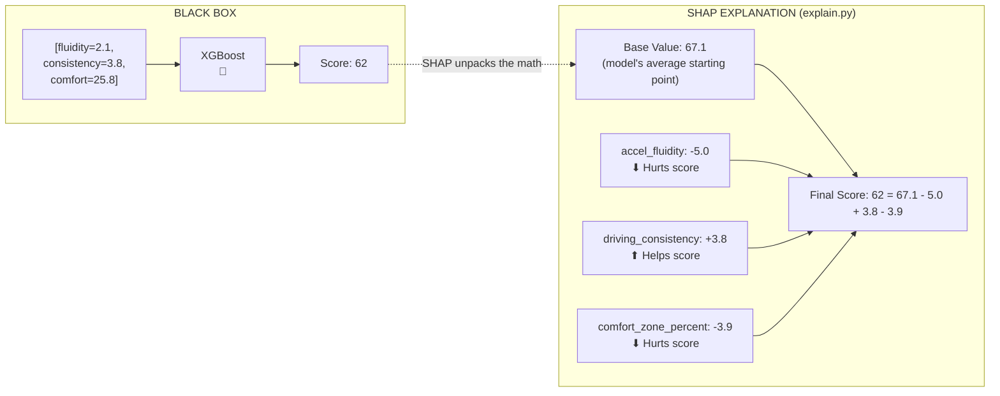

### Bidirectional XAI: Two Levels of Explanation

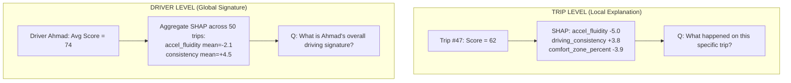

---

## Stage 6: Fairness — Is the Model Treating Everyone Equally?

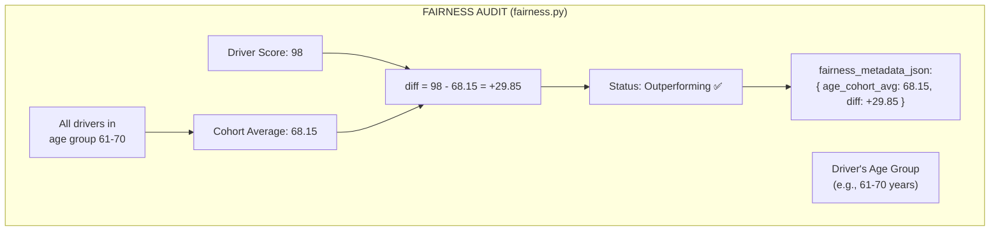

### The Fairness Philosophy: Context, Not Correction

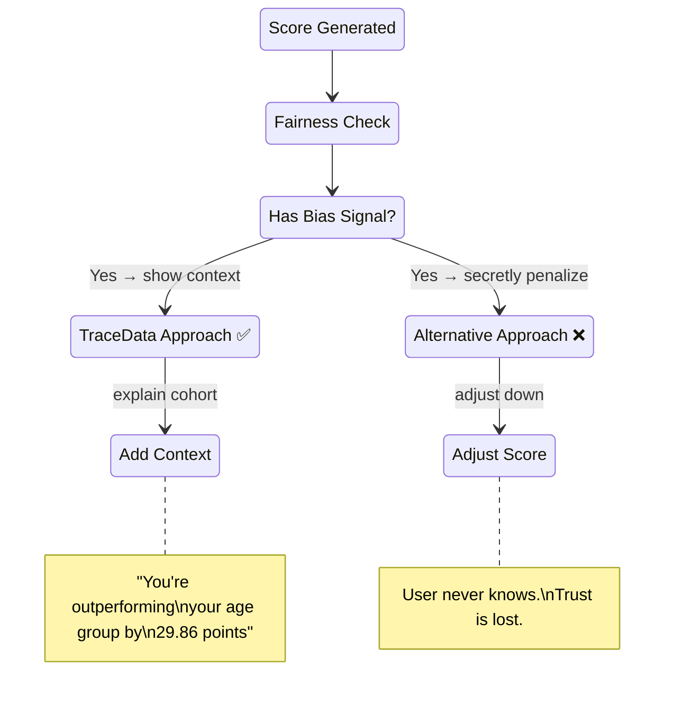

---

## Stage 7: The Behavior Agent — The Last Mile of Intelligence

The Agent layer converts raw JSON intelligence into a human coaching report.

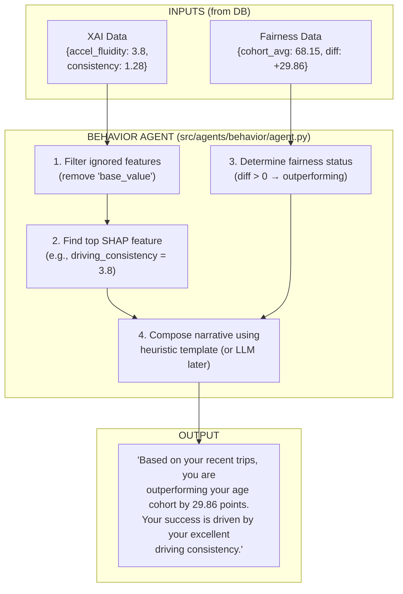

---

## Stage 8: MLOps — The End-to-End Deployment Architecture

This is the full production system showing how all components interact.

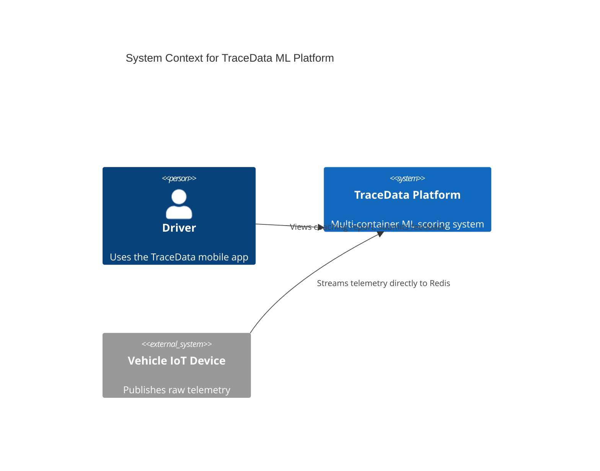

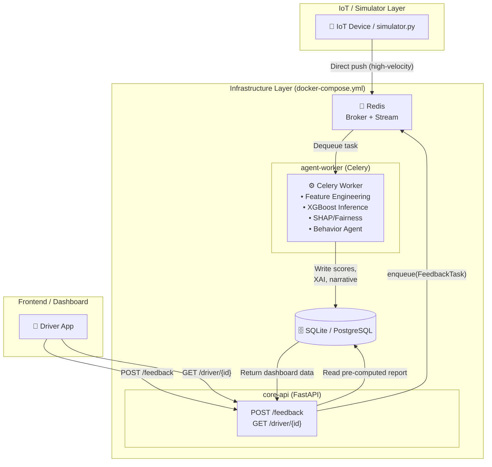

### Container Scaling Model

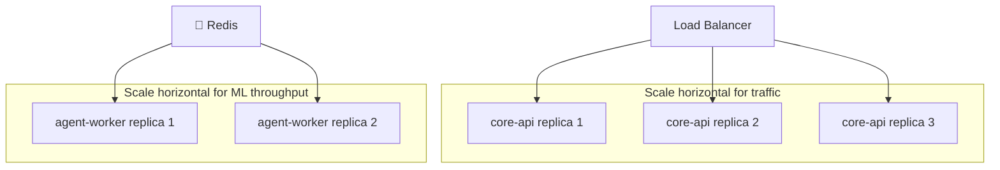

---

## End-to-End Data Flow: The Complete Journey

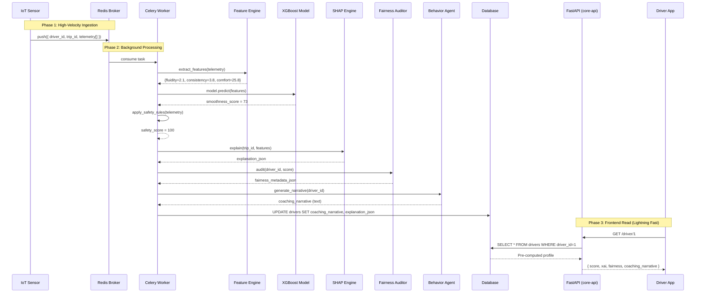

---

## 📂 Codebase Map

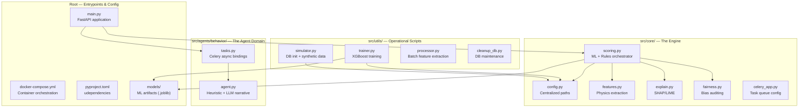

---

## 🎓 Glossary for the ML-Curious Engineer

| Term | Software Analogy | TraceData Equivalent |
| :--- | :--- | :--- |
| **Training** | Compiling code | `trainer.py` run |
| **Model Artifact** | `.jar` / `.dll` binary | `models/smoothness_model.joblib` |
| **Inference** | Calling a function | `model.predict(features)` in `scoring.py` |
| **Feature Engineering** | Data transformation | `src/core/features.py` |
| **SHAP** | Stack trace for model decisions | `explain.py` |
| **MLOps** | DevOps for ML models | `docker-compose.yml` + Celery |
| **Drift** | Memory leak / regression | Model accuracy degrading over time (future monitoring) |
| **Synthetic Data** | Unit test mocks | `src/utils/simulator.py` |
