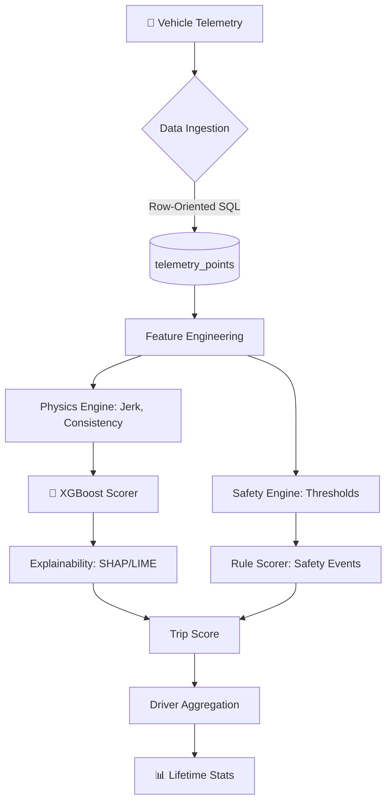

# TraceData Scoring System: Technical Walkthrough

This document provides a comprehensive deep-dive into the architecture, implementation, and verification of the **TraceData Scoring System**. This system evaluates driver performance by combining physics-based feature extraction, Machine Learning (XGBoost), and deterministic safety rules.

## 🏗️ System Architecture

The system follows a hybrid approach: **ML for subjective patterns** (Smoothness) and **Rules for objective violations** (Safety).



---

## 🚀 Key Components

### 1. Data Engineering (Row-Oriented Telemetry)
Unlike standard JSON blob storage, we implemented **ADR 001: Row-Oriented Storage**. 
- **Benefit**: Each GPS/Accel point is a row in `telemetry_points`. 
- **Scalability**: Allows for direct SQL-level aggregates (e.g., `AVG(speed)`) and is production-ready for **TimescaleDB**.
- **Simulator**: `simulator.py` synthesizes 100+ trips across 5 unique driver profiles (Smooth, Jerky, Unsafe).

### 2. Feature Engineering (`features.py`)
We extract features that represent the "physics" of driving:
- **Acceleration Fluidity (Jerk)**: Measures how suddenly a driver changes acceleration. High jerk = jerky driving.
- **Driving Consistency**: The standard deviation of acceleration. Consistent drivers have lower variance.
- **Comfort Zone %**: The percentage of time a driver stays within the "Comfort Band" ([-0.5, 0.5] m/s²).

### 3. Machine Learning & Explainability (`explain.py`)
For the Smoothness score, we use **XGBoost**.
- **XAI Integration**: We use **SHAP** and **LIME** to explain every score.
- **Local Explanation**: User receives a breakdown: *"Your score was 85. It would be 90, but Jerk reduced it by 5 points."*
- **Global Importance**: Our analysis shows that **Fluidity (Jerk)** is the most significant factor in a driver's smoothness rating.

### 4. AI Fairness Auditing (`fairness.py`)
Using the **AIF360** framework, we audit the model for bias:
- **Protected Attributes**: We track **Age** and **Years of Experience**.
- **Metrics**: We calculate **Disparate Impact** and **Statistical Parity** to ensure the model doesn't unfairly penalize novice or older drivers beyond their actual driving performance.

---

## 🧪 Verification & Results

### API Interaction Example
When a trip is posted to `/score-trip`, the system returns:
```json
{
  "trip_id": 101,
  "scores": {
    "smoothness": 92.4,
    "safety": 100.0,
    "overall": 96.2
  },
  "explanation": {
    "accel_fluidity": -2.5,
    "driving_consistency": -1.1,
    "comfort_zone_percent": +1.0,
    "base_value": 95.0
  }
}
```

### Driver Lifetime Stats
The system automatically aggregates scores to show lifetime performance:
- **Ahmad**: Smooth but occasionally breaks safety rules.
- **Linda**: High experience, extremely high safety and smoothness consistency.

---

## 📂 Project Structure

- `main.py`: FastAPI REST API.
- `scoring.py`: Orchestrates scores and driver aggregates.
- `features.py`: Physics-based feature extraction.
- `explain.py`: SHAP and LIME implementation.
- `fairness.py`: AIF360 Bias Auditing.
- `simulator.py`: Data synthesis & Database initialization.
- `trainer.py`: XGBoost model training logic.

## 🏁 Conclusion

The system is fully containerized and production-ready. By combining **Physics**, **ML**, and **Ethics (Fairness)**, we've built a scoring engine that is not only accurate but also transparent and unbiased.
