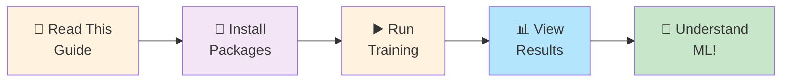

# Getting Started - For Absolute Beginners

**Don't worry if you've never done this before. We'll go step by step.**

---

## ✅ What You'll Do Today

By the end of this guide, you'll have:
1. ✅ Set up your computer
2. ✅ Trained a real ML model
3. ✅ Seen results in a web interface
4. ✅ Understood what happened

**Time needed:** ~30 minutes

### Your Learning Journey Today



---

## 🎯 Prerequisites (What You Need)

### 1. **Python Installed**
Python is a programming language. Check if it's installed:

**On Windows:**
```
Open PowerShell and type:
python --version
```

**On Mac/Linux:**
```
Open Terminal and type:
python3 --version
```

**Don't have it?** Go to https://python.org and download Python 3.9+ (click the big download button)

### 2. **A Code Editor (Optional but nice)**
- VS Code: https://code.visualstudio.com (free)
- Or use Notepad (works too!)

### 3. **Basic Command Line Skills**
Don't worry! We'll show you exactly what to type.

---

## 🚀 Step 1: Open Command Line

**Windows:**
1. Press `Win + R`
2. Type `powershell`
3. Press Enter

**Mac:**
1. Press `Cmd + Space`
2. Type `terminal`
3. Press Enter

**Linux:**
1. Press `Ctrl + Alt + T`

You should see something like:
```
C:\Users\YourName> 
```
or
```
$ 
```

---

## 📁 Step 2: Navigate to Project

First, let's go to where the project files are located.

```bash
cd d:\learning-projects\learning-ml\tracedata-candidate
```

**If this doesn't work**, tell your system where the project is:
- Replace `d:\learning-projects\learning-ml\tracedata-candidate` with your actual path
- **Windows users:** Use backslash `\` like in the example
- **Mac/Linux users:** Use forward slash `/`

After you press Enter, you should see:
```
d:\learning-projects\learning-ml\tracedata-candidate>
```

---

## 📦 Step 3: Install Required Tools

Machine learning needs special tools. Think of it like installing ingredients before cooking.

```bash
pip install mlflow xgboost scikit-learn pandas numpy
```

**What is each one?**
- **mlflow**: Records experiments (like a lab notebook)
- **xgboost**: The ML algorithm (the "brain")
- **scikit-learn**: Data science tools
- **pandas**: Works with data tables
- **numpy**: Math library

**This will take 2-5 minutes.** You'll see lots of text. That's normal. ✅

---

## ▶️ Step 4: Run the Training

Now for the magic moment! Run this command:

```bash
python -m src.mlops.training_pipeline
```

**What's happening?**
- The computer is reading our training code
- It's creating 300 fake trips with different driving styles
- It's training a machine learning model
- It's testing how accurate it is
- It's keeping track of everything

**You should see output like:**
```
Generating synthetic data...
Loading configuration from mlops_config.yaml
Creating SyntheticDataPipeline...
Generated 300 trips
Train/Val/Test split: 180/60/60

Preparing features...
Training model...
Evaluating on train set...
  MAE: 9.2
  RMSE: 12.5
  R² Score: 0.88

Quality Gate: PASSED ✅
Model saved to models/smoothness_model.joblib

Run logged to MLFlow
Run ID: abc123def456...
```

**Expected time:** 1-3 minutes (depends on your computer)

---

## 📊 Step 5: View Results

After training completes, run:

```bash
mlflow ui
```

This opens a **web interface** where you can see:
- ✅ Model performance
- ✅ All settings used
- ✅ Comparison between runs
- ✅ Pretty graphs

**You should see:**
```
[some text...]
INFO: Running on http://127.0.0.1:5000
```

**Now:**
1. Open your web browser (Chrome, Firefox, Safari, Edge)
2. Go to: `http://localhost:5000`

You'll see a beautiful dashboard! ✨

---

## 🎓 Step 6: Understand What You See

### The MLFlow Dashboard

**Left side - List of experiments:**
- You'll see `smoothness-scoring-production` (that's ours!)
- Click it to see all training runs

**Main area - Your latest run:**

| Metric | What It Means | Good Value |
|--------|---------------|-----------|
| **R² Score** | Accuracy (0-1) | > 0.85 (85%+) |
| **MAE** | Average error | Lower is better |
| **RMSE** | Spread of errors | Lower is better |
| **Parameters** | Settings used | Shows what you chose |

**What you want to see:**
✅ R² Score: `0.85` or higher
✅ Test RMSE: Under `20`
✅ Quality Gate: **PASSED**

---

## 🔍 Step 7: Understanding the Training Process

Let's walk through what happened:

### Stage 1: Generate Data
```
Goal: Create 300 fake driving trips
Why: We don't have real data yet
How: Computer simulates 4 different driver types
- Smooth drivers (like a taxi pro)
- Normal drivers (like you probably)
- Jerky drivers (aggressive movements)
- Unsafe drivers (dangerous behavior)

Result: 300 trips × 18 measurements per trip
```

### Stage 2: Prepare Data
```
Goal: Organize data for machine learning
Why: ML needs data in a specific format

What we have for each trip:
- Speed info (average, max, changes)
- Acceleration info (harsh braking, acceleration, jerks)
- Turning info (lateral G-forces, hard corners)
- Engine info (RPM, over-revving, idle time)
- Labels: Smoothness score (0-100)

Think of it like: Each trip is a row in a spreadsheet
Each measurement is a column
```

### Stage 3: Train Model
```
Goal: Teach the computer to predict smoothness
How: 
- Split data: 60% for training, 20% for validation, 20% for testing
- XGBoost algorithm: Creates 200 decision trees
- Each tree asks questions:
  * "Is this driver's jerk > 0.05?"
  * "Are harsh brakes > 8?"
  * Votes on final answer

Result: A model that can predict smoothness for new drivers
```

### Stage 4: Evaluate Model
```
Goal: Check how good the model is
Metrics:
- R² = 0.88 means: "88% of the variation explained"
- RMSE = 12 means: "Average error is ~12 points"
- MAE = 8.8 means: "Typical prediction off by ~9 points"

Reality check:
- Smoothness range: 0-100
- Error of 12: That's pretty good! Like ±12% error
```

### Stage 5: Save & Log
```
Goal: Keep the model for later use
Saved files:
- models/smoothness_model.joblib (the trained model)
- MLFlow database (all results saved)

Why: Can predict for new drivers without retraining
```

---

## 💭 What Does This Mean Practically?

### Your Model Can Now:

**✅ Predict smoothness for new drivers**
```
New driver data comes in → Model predicts → 87 (smoothness score)
```

**✅ Measure driver safety**
```
Driver 1 scored → 92 (very smooth) → Safe
Driver 2 scored → 45 (dangerous) → Needs training
```

**✅ Rank drivers**
```
Driver 1: 92 ✅ Best
Driver 2: 78 ✅ Good
Driver 3: 65 ← Below average
Driver 4: 42 ❌ Dangerous
```

---

## 🧠 Key Concepts (Very Simply)

### Machine Learning in 3 Steps:

1. **Show Examples**
   ```
   Trip 1: [speed, jerk, acceleration...] → Smoothness = 88
   Trip 2: [speed, jerk, acceleration...] → Smoothness = 65
   Trip 3: [speed, jerk, acceleration...] → Smoothness = 45
   ... (300 trips)
   ```

2. **Computer Finds Pattern**
   ```
   "I notice:"
   - Smooth drivers have low jerk
   - Rough drivers have high harsh_brakes
   - Aggressive drivers over-rev the engine
   ```

3. **Predict for New Cases**
   ```
   New driver: [speed, jerk, acceleration...]
   Model says: "This looks like smoothness = 75"
   ```

### What's a "Model"?
- It's like a **person who's been trained**
- You've shown them 300 examples
- Now they can rate a new driver
- The "training" files inside the model = the 300 examples it learned from

### What's XGBoost?
- It's a specific way to train the "person"
- Uses 200 small decision trees (like voting)
- Each tree votes, then combine votes for final answer
- Very effective for this type of problem

---

## 📝 What the Files Mean

After training, you'll see new files/folders:

```
tracedata-candidate/
├── mlruns/                    ← All experiment results (DON'T DELETE!)
│   └── smoothness-scoring-production/
│       └── (experiment-id)/   ← Your specific run
│           ├── run.json       ← Metadata about the run
│           └── artifacts/     ← Results and model files
│
├── models/
│   └── smoothness_model.joblib  ← Your trained model! (can use this later)
│
├── data/
│   ├── synthetic_data.csv       ← The 300 fake trips
│   ├── train_data.csv           ← 180 trips for training
│   ├── val_data.csv             ← 60 trips for validation
│   └── test_data.csv            ← 60 trips for testing
│
└── logs/
    ├── training.log             ← What happened during training
    └── validation.log           ← Validation results logged
```

---

## 🎯 Next Steps

### Option 1: Just Understand (Right Now)
1. Keep the MLFlow UI open
2. Click through the experiment
3. Read the code comments in `src/core/smoothness_ml_engine.py`
4. Understand what each part does

### Option 2: Do Experiments (Next Hour)
1. Edit `config/mlops_config.yaml`
2. Change settings like:
   ```yaml
   n_estimators: 250  # More trees = more accurate but slower
   learning_rate: 0.03  # Lower = more careful learning
   max_depth: 8  # Deeper = more complex patterns
   ```
3. Run training again: `python -m src.mlops.training_pipeline`
4. Compare results in MLFlow
5. See what made it better/worse!

### Option 3: Deep Dive (This Week)
1. Read `docs/FEATURE_ENGINEERING.md` (what each data field means)
2. Read `docs/ARCHITECTURE.md` (how system fits together)
3. Read `src/core/smoothness_ml_engine.py` (the actual code)
4. Experiment with modifications

---

## 🐛 Troubleshooting

### "Command not found: python"
**Solution:** Python isn't installed or not in PATH
- Download Python from https://python.org
- During installation: **CHECK "Add Python to PATH"**
- Restart your computer

### "ModuleNotFoundError: No module named 'mlflow'"
**Solution:** Packages not installed
```bash
pip install mlflow xgboost scikit-learn pandas numpy
```

### "Permission denied"
**Solution:** Your user doesn't have permission
- Try: `pip install --user mlflow ...`
- Or use admin/sudo

### MLFlow UI won't open at http://localhost:5000
**Solution:** Port is busy
```bash
# Kill whatever's using it, or use different port:
mlflow ui --port 5001
```

### Model training takes forever
**Solution:** That's normal for first run!
- Check: Is your progress updating? (should see messages)
- Try: Reduce `n_estimators` in config (from 200 to 100)

### "FileNotFoundError: config/mlops_config.yaml not found"
**Solution:** You're in wrong directory
```bash
cd d:\learning-projects\learning-ml\tracedata-candidate
```

---

## ✅ Checklist: Did You Succeed?

- [ ] Python installed (check with `python --version`)
- [ ] Packages installed (check with `pip list`)
- [ ] Navigated to right directory
- [ ] Ran training: `python -m src.mlops.training_pipeline`
- [ ] Saw R² > 0.85
- [ ] Opened MLFlow UI at localhost:5000
- [ ] Viewed experiment results
- [ ] Understood what happened

**If you checked all 8:** 🎉 **Congratulations! You've trained your first ML model!**

---

## 📚 What to Read Next

Based on your interest:

**🎨 I want to see results visually**
→ Read: `docs/DATA_FLOW.md` (ASCII diagrams of how data flows)

**📊 I want to understand the data**
→ Read: `docs/FEATURE_ENGINEERING.md` (what each measurement means)

**🧠 I want to understand the algorithm**
→ Read: `docs/ARCHITECTURE.md` (how XGBoost works, simply)

**💻 I want to read the actual code**
→ Read: File `src/core/smoothness_ml_engine.py` (all code is heavily commented!)

**🔬 I want to understand predictions**
→ Read: `docs/SHAP_EXPLAINABILITY.md` (why model predicts what it does)

**⚙️ I want to tune the model**
→ Read: `config/mlops_config.yaml` (all settings explained)

---

## 🎓 Learning Tips

### 1. **Experiment and Learn**
```bash
# Try this:
1. Edit config/mlops_config.yaml
2. Change n_estimators from 200 to 100
3. Run training again
4. Which was faster? Which was more accurate?
```

### 2. **Read Code Comments**
```python
# Open src/core/smoothness_ml_engine.py
# Every function has comments explaining what it does
# This is how you understand ML code
```

### 3. **Understand Error = Learning**
```
If RMSE goes UP after changing settings:
✅ You learned what makes it worse!

If R² goes DOWN:
✅ You learned those settings weren't good!

Every experiment teaches you something.
```

### 4. **Docs Are Your Friend**
```
Questions? Check:
1. docs/ folder (explanations)
2. Code comments (inline help)
3. README.md (this file!)
4. Run the code yourself (learning by doing)
```

---

## 🎯 "I Want to Learn More" - Resources

### About Machine Learning:
- 📖 "Hands-On Machine Learning" by Aurélien Géron (free PDF online)
- 🎥 YouTube: "Machine Learning Basics" by StatQuest
- 📝 Google: "What is XGBoost?" (lots of good articles)

### About Python:
- 🎥 YouTube: "Python for Beginners" by Corey Schafer
- 📖 Free book: "Automate the Boring Stuff with Python"
- 💻 Practice: `codewars.com` or `hackerrank.com`

### About Pandas & NumPy:
- 📖 "Python for Data Analysis" by Wes McKinney
- 🎥 YouTube: "Pandas Tutorial" by Corey Schafer

---

## 🤔 Frequently Asked Questions

### Q: What does "cross-validation" mean?
**A:** Split data into 5 parts. Train on 4, test on 1. Repeat 5 times (different test part each time). You get 5 accuracy scores. This tests if model is consistent.

### Q: Why do we use "fake data"?
**A:** Speed! Real data takes time to collect. We test the system first with fake data, then use real data later.

### Q: What would make the model better?
**A:** 
- More training data (more examples to learn from)
- Better features (more useful measurements)
- Better hyperparameters (settings tuning)
- Different algorithm (other ML techniques)

### Q: Can I use this model in the real world?
**A:** Yes, eventually! But first:
1. Test with real data
2. Make sure it's accurate enough
3. Monitor performance over time
4. Update when needed

### Q: What's "overfitting"?
**A:** Model memorizes training data instead of learning patterns.
- Like memorizing answers instead of understanding
- Fix: Simpler model or more data

### Q: How often should I retrain?
**A:** 
- When you get new data (drivers change behavior)
- When accuracy drops
- Monthly checkin (good practice)

---

## 🚀 You're Ready!

You now understand:
✅ What machine learning is (learning from examples)
✅ How to train a model (give data, computer learns)
✅ How to evaluate results (R², RMSE, accuracy)
✅ How to track experiments (MLFlow)
✅ What the next steps are (more data, better tuning)

**This is production-quality code and workflow!**

You've taken the first step to becoming an ML engineer. Keep learning, keep experimenting, ask questions when stuck.

---

## 📞 When You Get Stuck

1. **Read the error message carefully** (usually tells you what's wrong)
2. **Check the troubleshooting section** (above)
3. **Look at code comments** (in the actual `.py` files)
4. **Read the docs folder** (explanations for concepts)
5. **Try something different** (best way to learn!)

---

## 🎉 Final Checklist

Before you move on:

- [ ] Training completed successfully
- [ ] R² score was > 0.85 (good!)
- [ ] MLFlow UI is working
- [ ] You saw the results
- [ ] You understand what happened (roughly)
- [ ] You feel ready to keep learning

**If yes to all:** You're ready for the next step!

Go read `docs/FEATURE_ENGINEERING.md` (what each data field means).

---

**Congratulations on training your first ML model! 🎉**

This is real machine learning. You should be proud!

