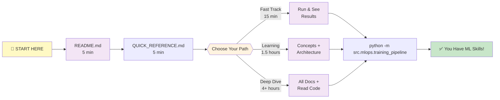

# Navigation Guide - Where to Go for What

**A map through the tracedata-candidate project. Find exactly what you need!**

---

## 🗺️ Learning Paths (Choose Your Adventure!)



---

## 📖 Document Roadmap by Goal

### Goal 1: "I Just Want to See It Work" (15 minutes)

**Your Journey:**
1. Read: [README.md](README.md) - Overview (5 min)
2. Read: [GETTING_STARTED.md](GETTING_STARTED.md) - Part 1 only (first 5 sections) (5 min)
3. Run: `python -m src.mlops.training_pipeline` (2-3 min)
4. View: `mlflow ui` at http://localhost:5000 (1 min)

**What you'll understand:** ML models can be trained and generate scores!

---

### Goal 2: "I Need to Understand What's Happening" (45 minutes)

**Your Journey:**
1. Read: [CONCEPTS_EXPLAINED.md](CONCEPTS_EXPLAINED.md) - Mental models without jargon (15 min)
2. Read: [GETTING_STARTED.md](GETTING_STARTED.md) - Full guide (15 min)
3. Read: [docs/ARCHITECTURE.md](docs/ARCHITECTURE.md) - How it all fits (15 min)

**What you'll understand:** Real ML fundamentals, how systems work together!

---

### Goal 3: "I Want to Run and Modify It" (2 hours)

**Your Journey:**
1. Complete Goal 2 above (45 min)
2. Read: [docs/FEATURE_ENGINEERING.md](docs/FEATURE_ENGINEERING.md) - What data means (15 min)
3. Read: [docs/MLOPS_GUIDE.md](docs/MLOPS_GUIDE.md) - Training configuration (20 min)
4. Try: Edit `config/mlops_config.yaml`, run training, compare results (40 min)

**What you'll understand:** How to tune ML systems for better results!

---

### Goal 4: "I Want to Understand Everything Deeply" (4 hours)

**Your Journey:**
1. Complete Goal 3 above (2 hours)
2. Read: [docs/DATA_FLOW.md](docs/DATA_FLOW.md) - Visual flow (20 min)
3. Read: [docs/SHAP_EXPLAINABILITY.md](docs/SHAP_EXPLAINABILITY.md) - Understanding predictions (20 min)
4. Read: [docs/SHAP_QUICK_REFERENCE.md](docs/SHAP_QUICK_REFERENCE.md) - Quick lookup (10 min)
5. Read code comments in:
   - [src/core/smoothness_ml_engine.py](src/core/smoothness_ml_engine.py) (40 min)
   - [src/utils/data_generation_strategy.py](src/utils/data_generation_strategy.py) (20 min)
   - [src/mlops/training_pipeline.py](src/mlops/training_pipeline.py) (30 min)

**What you'll understand:** Complete ML system design and implementation!

---

## 🎯 "I Have a Specific Question" - Find Your Answer

### Question: "What is machine learning?"
**Read:** [CONCEPTS_EXPLAINED.md](CONCEPTS_EXPLAINED.md#-the-core-idea-learning-from-examples)
**Time:** 5 minutes

### Question: "What do the 18 features mean?"
**Read:** [docs/FEATURE_ENGINEERING.md](docs/FEATURE_ENGINEERING.md)
**Time:** 15 minutes

### Question: "How do I run the training?"
**Read:** [GETTING_STARTED.md](GETTING_STARTED.md#-step-4-run-the-training)
**Time:** 5 minutes

### Question: "What does R² = 0.88 mean?"
**Read:** [CONCEPTS_EXPLAINED.md](CONCEPTS_EXPLAINED.md#-understanding-accuracy-the-report-card)
**Time:** 5 minutes

### Question: "How do I change settings?"
**Read:** [QUICK_REFERENCE.md](QUICK_REFERENCE.md#-common-tweaks)
**Time:** 5 minutes

### Question: "Why is my R² low?"
**Read:** [docs/MLOPS_GUIDE.md](docs/MLOPS_GUIDE.md#troubleshooting)
**Time:** 10 minutes

### Question: "How do I understand predictions?"
**Read:** [docs/SHAP_EXPLAINABILITY.md](docs/SHAP_EXPLAINABILITY.md)
**Time:** 20 minutes

### Question: "What files do what?"
**Read:** [CONCEPTS_EXPLAINED.md](CONCEPTS_EXPLAINED.md#-in-plain-english-what-this-system-does)
**Time:** 5 minutes

### Question: "What's the quickest way to get started?"
**Read:** [QUICK_REFERENCE.md](QUICK_REFERENCE.md#-minimal-quick-start-5-min)
**Time:** 5 minutes

### Question: "How does XGBoost work?"
**Read:** [CONCEPTS_EXPLAINED.md](CONCEPTS_EXPLAINED.md#-how-computers-learn-the-voting-committee-metaphor)
**Time:** 10 minutes

---

## 📚 Document Purpose Summary

| File | Purpose | Read If... | Time |
|------|---------|-----------|------|
| **README.md** | Main hub | You're starting | 5 min |
| **GETTING_STARTED.md** | Step-by-step tutorial | You want to learn properly | 20 min |
| **QUICK_REFERENCE.md** | Cheatsheet & troubleshooting | You need quick answers | 10 min |
| **CONCEPTS_EXPLAINED.md** | Simple explanations | You're new to ML | 20 min |
| **docs/ARCHITECTURE.md** | System design | You want to understand how it works | 15 min |
| **docs/FEATURE_ENGINEERING.md** | Data explanation | You want to know what data means | 15 min |
| **docs/DATA_FLOW.md** | Visual flow | You're a visual learner | 10 min |
| **docs/MLOPS_GUIDE.md** | Training guide | You want to tune & experiment | 20 min |
| **docs/SHAP_EXPLAINABILITY.md** | Understanding predictions | You want to interpret results | 20 min |
| **docs/SHAP_QUICK_REFERENCE.md** | SHAP quick lookup | You need fast answers about SHAP | 5 min |
| **config/mlops_config.yaml** | Settings | You want to change behavior | 5 min |
| **src/core/smoothness_ml_engine.py** | Code | You want to understand code | 40 min |
| **src/utils/data_generation_strategy.py** | Data generation code | You want to see how data is created | 20 min |
| **src/mlops/training_pipeline.py** | Training code | You want to see training orchestration | 30 min |

---

## 🎓 Stage-Based Learning Path

### Stage 1: Awareness (30 minutes)
**Goal:** Understand what this project does

**Read:**
- [ ] README.md
- [ ] QUICK_REFERENCE.md

**Do:**
- [ ] Run training once
- [ ] View results in MLFlow

**Outcome:** "I get it, this trains models"

---

### Stage 2: Understanding (1.5 hours)
**Goal:** Understand core concepts

**Read:**
- [ ] CONCEPTS_EXPLAINED.md
- [ ] GETTING_STARTED.md
- [ ] docs/ARCHITECTURE.md

**Do:**
- [ ] Run training
- [ ] Change one config value
- [ ] Run training again
- [ ] Compare results

**Outcome:** "I understand what's happening and how to tune it"

---

### Stage 3: Competence (3 hours)
**Goal:** Use system confidently

**Read:**
- [ ] docs/FEATURE_ENGINEERING.md
- [ ] docs/MLOPS_GUIDE.md
- [ ] docs/DATA_FLOW.md

**Do:**
- [ ] Change multiple config settings
- [ ] Run several trainings
- [ ] Compare all results in MLFlow
- [ ] Understand why changes worked/failed

**Outcome:** "I can modify and tune this system"

---

### Stage 4: Mastery (4+ hours)
**Goal:** Understand implementation details

**Read:**
- [ ] Code comments in src/core/
- [ ] Code comments in src/mlops/
- [ ] Code comments in src/utils/
- [ ] docs/SHAP_EXPLAINABILITY.md

**Do:**
- [ ] Understand each function
- [ ] Modify code
- [ ] Test your changes
- [ ] Add your own features

**Outcome:** "I can build ML systems from scratch"

---

## 🧭 Reading Paths by Experience Level

### Path A: Complete Beginner (Never coded before)

```
Week 1:
├─ Day 1: README.md + CONCEPTS_EXPLAINED.md
├─ Day 2: GETTING_STARTED.md (first half)
├─ Day 3: GETTING_STARTED.md (run + watch)
├─ Day 4: QUICK_REFERENCE.md
└─ Day 5: docs/ARCHITECTURE.md

Week 2:
├─ Read docs/FEATURE_ENGINEERING.md
├─ Run training
├─ Experiment with config.yaml
├─ View results
└─ Review QUICK_REFERENCE cheatsheet

Week 3+:
├─ Read remaining docs/
├─ Start reading code with comments
├─ Try modifying small things
└─ Run and test your changes
```

---

### Path B: Software Engineer (No ML experience)

```
Day 1:
├─ Skim README.md
├─ QUICK_REFERENCE.md (commands)
└─ Run training

Day 2:
├─ docs/ARCHITECTURE.md (system design)
├─ Read code files
└─ Understand the pipeline

Day 3+:
├─ Review docs/ deeper
├─ Modify and experiment
├─ Build intuition through iteration
└─ Ready to deploy/integrate
```

---

### Path C: ML Engineer (New to this project)

```
Day 1:
├─ README.md (overview)
├─ Skim all docs/
├─ Run training
└─ View MLFlow

Day 2+:
├─ Read code files
├─ Experiment with config
├─ Understand integration points
└─ Ready to maintain/extend
```

---

## 🔍 How to Navigate Within Documents

### Each document has:
- **Table of Contents** (at top) - Jump to sections
- **Section Headers** (with icons) - Easy to scan
- **Code Examples** - Copy and paste
- **Checklists** - Track your progress
- **Bold Text** - Highlights important points

**Tip:** If a document is long, use `Ctrl+F` (Windows) or `Cmd+F` (Mac) to search!

---

## 🎯 Speed Targets

| Goal | Read Time | Do Time | Total |
|------|-----------|--------|-------|
| "Show me it works" | 5 min | 3 min | 8 min |
| "Basic understanding" | 25 min | 5 min | 30 min |
| "Can modify it" | 45 min | 1 hour | 1h 45min |
| "Can build similar systems" | 2 hours | 2 hours | 4 hours |
| "Can optimize for production" | 4 hours | ongoing | weeks |

---

## 📱 Which Device Best For What?

| Task | Best Device | Why |
|------|-------------|-----|
| Reading docs | Phone/tablet | Portable, easy reading |
| Running code | Computer | Need terminal |
| Experimenting | Computer | Need screen for MLFlow UI |
| Coding/modifying | Computer | Big screen needed |
| Looking up concepts | Any device | Docs are simple |

---

## 💾 Print Checklist: Beginner's First Week

- [ ] Day 1: Read README.md (5 min)
- [ ] Day 1: Skim QUICK_REFERENCE.md (5 min)
- [ ] Day 2: Read GETTING_STARTED.md sections 1-4 (15 min)
- [ ] Day 2: Run training - `python -m src.mlops.training_pipeline` (3 min)
- [ ] Day 3: View MLFlow - `mlflow ui` (1 min)
- [ ] Day 3: Read CONCEPTS_EXPLAINED.md (20 min)
- [ ] Day 4: Read docs/ARCHITECTURE.md (15 min)
- [ ] Day 5: Change one value in config/mlops_config.yaml (2 min)
- [ ] Day 5: Run training again (3 min)
- [ ] Day 5: Compare results in MLFlow (5 min)

**Total Time: ~1 hour 30 minutes**
**What you'll know: Fundamentals of ML systems**

---

## 🚀 Next Steps After Navigation

1. **Pick your experience level** (Beginner/Engineer/ML-experienced)
2. **Choose your learning pace:**
   - Fast track: Read QUICK_REFERENCE only
   - Standard: Follow stage-based path
   - Deep dive: Read everything in order
3. **Start reading:** Begin with top of your path
4. **Run code:** Do the exercises
5. **Experiment:** Modify and try things
6. **Ask questions:** Docs have FAQ sections

---

## 🆘 Can't Find What You Need?

**Search the docs:**
- Open any `.md` file
- Use `Ctrl+F` (Windows) or `Cmd+F` (Mac)
- Type what you're looking for
- Should find it!

**Most common searches:**
- "XGBoost": docs/ARCHITECTURE.md
- "Features": docs/FEATURE_ENGINEERING.md
- "Run training": GETTING_STARTED.md or QUICK_REFERENCE.md
- "R² score": CONCEPTS_EXPLAINED.md
- "MLFlow": docs/MLOPS_GUIDE.md
- "Error": QUICK_REFERENCE.md (troubleshooting section)

---

## ✨ Pro Tips for Learning

1. **Don't read everything at once** - Do one document per session
2. **Read + Do** - Don't just read, try things!
3. **Use Ctrl+F** - Search instead of scrolling
4. **Take notes** - Write things down
5. **Experiment** - Change settings and see what happens
6. **Reference documents** - Come back to them
7. **Have fun** - This is amazing stuff you're learning!

---

## 🎉 You're Now Equipped!

You have:
- ✅ Complete documentation
- ✅ Step-by-step guides  
- ✅ Quick references
- ✅ Code with comments
- ✅ This navigation guide

**Next step:** Pick a path above and start reading!

Good luck! 🚀

