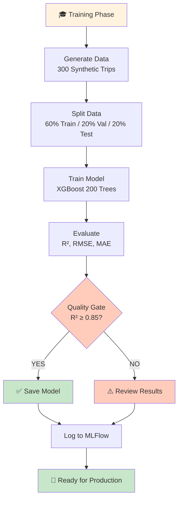

# Architecture - How Everything Works (Simply!)

**Goal:** Understand the big picture without overwhelming technical jargon.

---

## 🎯 The Big Picture

### What Problem Are We Solving?

```
Company Problem: "We have truck drivers, but we don't know who drives smoothly"

Our Solution: "Build a system that learns from examples and predicts smoothness"

Why? Smooth drivers = safer, more fuel-efficient, happier passengers
```

### The Simple Version

```
┌─────────────────────────────────────────────────────────────────┐
│                    SMOOTHNESS SCORING SYSTEM                     │
├─────────────────────────────────────────────────────────────────┤
│                                                                   │
│  INPUT: Driving Data (speed, acceleration, jerk, etc.)           │
│         ↓                                                         │
│  PROCESS: Machine Learning Model (trained on 300 examples)       │
│         ↓                                                         │
│  OUTPUT: Smoothness Score (0-100)                                │
│                                                                   │
│  BONUS: Explains WHY (feature importance)                        │
│                                                                   │
└─────────────────────────────────────────────────────────────────┘
```

---

## 🏗️ The Architecture (4 Main Components)

### Component 1: Data Generator
**What:** Creates fake driving trips for training
**Why:** We don't have real data yet
**How:** Simulates 4 different driver styles

```
┌──────────────────────────────────────┐
│   DATA GENERATION ENGINE             │
├──────────────────────────────────────┤
│                                       │
│ 4 Driver Profiles:                   │
│ • Smooth (professional)              │
│ • Normal (average)                   │
│ • Jerky (aggressive)                 │
│ • Unsafe (dangerous)                 │
│                                       │
│ Output: 300 synthetic trips          │
│ Each trip: 18 measurements           │
│                                       │
└──────────────────────────────────────┘
         ↓ 
    300 trips × 18 features
         ↓
    Ready to train!
```

**File:** `src/utils/data_generation_strategy.py`

---

### Component 2: ML Engine
**What:** The core machine learning logic
**Why:** Trains on data and predicts smoothness
**How:** Uses XGBoost algorithm (200 decision trees)

```
┌──────────────────────────────────────┐
│    SMOOTHNESS ML ENGINE              │
├──────────────────────────────────────┤
│                                       │
│ Feature Extraction:                  │
│ • Parse raw telematics data          │
│ • Extract 18 features                │
│                                       │
│ Aggregation:                         │
│ • Combine 12 windows into trip-level │
│   statistics                         │
│                                       │
│ Label Generation:                    │
│ • Calculate smoothness (0-100)       │
│                                       │
│ Model Training:                      │
│ • XGBoost: 200 trees, max_depth=7   │
│ • Early stopping for efficiency      │
│                                       │
│ Prediction:                          │
│ • Score new driving trips            │
│                                       │
│ Explanation:                         │
│ • SHAP: Show which features matter   │
│                                       │
└──────────────────────────────────────┘
```

**File:** `src/core/smoothness_ml_engine.py`

---

### Component 3: Training Pipeline (MLOps)
**What:** Orchestrates the entire training workflow
**Why:** Professional, reproducible training process
**How:** Coordinates data generation → training → evaluation → logging

```
┌──────────────────────────────────────┐
│     TRAINING PIPELINE (MLOPS)        │
├──────────────────────────────────────┤
│                                       │
│ 1. GENERATE DATA                     │
│    Create 300 synthetic trips        │
│                                       │
│ 2. SPLIT DATA                        │
│    Train (60%) | Val (20%) | Test(20%)│
│                                       │
│ 3. PREPARE FEATURES                  │
│    Extract 18 features per trip      │
│                                       │
│ 4. TRAIN MODEL                       │
│    XGBoost learns from training data │
│                                       │
│ 5. EVALUATE                          │
│    Test on validation and test sets  │
│                                       │
│ 6. CROSS-VALIDATE                    │
│    5-fold CV for stability check     │
│                                       │
│ 7. QUALITY GATE                      │
│    R² ≥ 0.85? Pass (save) / Fail     │
│                                       │
│ 8. LOG RESULTS                       │
│    MLFlow records everything         │
│                                       │
└──────────────────────────────────────┘
```

**File:** `src/mlops/training_pipeline.py`

---

### Component 4: Configuration Management
**What:** Central settings for the entire system
**Why:** Change behavior without editing code
**How:** YAML file with all parameters

```
┌──────────────────────────────────────┐
│       CONFIGURATION (YAML)           │
├──────────────────────────────────────┤
│                                       │
│ MLFlow Settings:                     │
│ • Experiment name                    │
│ • Storage location                   │
│                                       │
│ Model Parameters:                    │
│ • n_estimators: 200                  │
│ • max_depth: 7                       │
│ • learning_rate: 0.05                │
│                                       │
│ Data Settings:                       │
│ • Drivers to simulate: 20            │
│ • Trips per driver: 15               │
│ • Driver profile distribution        │
│                                       │
│ Quality Gates:                       │
│ • Min R² score: 0.85                 │
│ • Min RMSE threshold                 │
│                                       │
│ CV Settings:                         │
│ • n_splits: 5                        │
│ • shuffle: True                      │
│                                       │
└──────────────────────────────────────┘
```

**File:** `config/mlops_config.yaml`

---

## 📊 Data Flow (Complete Picture)

```
STEP 1: Raw Input
┌─────────────────────────────────────┐
│ Device sends telematics data        │
│ (speed, acceleration, etc.)         │
└──────────┬──────────────────────────┘
           ↓
STEP 2: Parse
┌─────────────────────────────────────┐
│ Extract 18 features from raw data   │
│ • Longitudinal (5)                  │
│ • Lateral (3)                       │
│ • Speed (3)                         │
│ • Jerk (3)                          │
│ • Engine (4)                        │
└──────────┬──────────────────────────┘
           ↓
STEP 3: Aggregate (per trip)
┌─────────────────────────────────────┐
│ Combine 12 windows into trip stats  │
│ Mean, Max, Sum strategies           │
│ Result: 18 features per trip        │
└──────────┬──────────────────────────┘
           ↓
STEP 4: Generate Labels (Training Only)
┌─────────────────────────────────────┐
│ Create smoothness score (0-100)     │
│ Based on 18 features                │
│ Formula: 90 - penalties + noise     │
└──────────┬──────────────────────────┘
           ↓
STEP 5: Train Model
┌─────────────────────────────────────┐
│ XGBoost learns pattern              │
│ From 300 trips (training data)      │
│ 200 decision trees                  │
│ Result: Trained model               │
└──────────┬──────────────────────────┘
           ↓
STEP 6: Evaluate
┌─────────────────────────────────────┐
│ Test on unseen data                 │
│ Measure R², RMSE, MAE              │
│ Check quality gate (R² ≥ 0.85)     │
└──────────┬──────────────────────────┘
           ↓
STEP 7: Save & Log
┌─────────────────────────────────────┐
│ Save model to: models/              │
│ Log metrics to: MLFlow              │
│ Result: Reusable model + history    │
└──────────┬──────────────────────────┘
           ↓
STEP 8: Predict (Using Trained Model)
┌─────────────────────────────────────┐
│ New driving data arrives            │
│ Extract 18 features (same way)      │
│ Pass through trained model          │
│ Get smoothness score                │
│ Get feature importance (SHAP)       │
└──────────┬──────────────────────────┘
           ↓
FINAL OUTPUT
┌─────────────────────────────────────┐
│ Smoothness: 87 / 100                │
│ Confidence: High                    │
│ Key factors: [jerk, harsh_brakes]  │
│ Recommendation: Good driver         │
└─────────────────────────────────────┘
```

---

## 🎓 How the Algorithm Works (Simply)

### What is XGBoost?

Think of it like a **committee voting system**:

```
1. MANY EXPERTS
   200 decision trees (experts)
   Each is trained on different aspects of data

2. EACH EXPERT VOTES
   Tree 1: "I think smoothness = 85"
   Tree 2: "I think smoothness = 92"
   Tree 3: "I think smoothness = 81"
   ... (197 more experts)

3. COMBINE VOTES
   Average all votes
   Weighted combination
   Result: Final prediction = 87

4. CONFIDENT?
   If many agree (85, 92, 81 are close) → High confidence
   If few agree → Low confidence
```

### Why Is This Good?

✅ **Handles complexity** - Can find non-linear patterns
✅ **Fast** - Uses parallel processing  
✅ **Robust** - Doesn't overfit easily
✅ **Interpretable** - Can see which features matter
✅ **Scalable** - Works with lots of data

---

## 📈 The 18 Features Explained (Conceptually)

### Dimension 1: Longitudinal Motion (5 features)
**What:** Forward/backward acceleration
**Why:** Harsh braking and acceleration hurt smoothness

```
Good: Smooth acceleration, consistent pressure
Bad:  Jerky starts, sudden hard braking
```

Features:
- mean_accel_g: Average acceleration
- max_decel_g: Hardest braking
- harsh_brake_count: Number of sudden stops
- jerk in acceleration: How "jerky"

### Dimension 2: Lateral Motion (3 features)
**What:** Left/right turning
**Why:** Hard turning is uncomfortable

```
Good: Smooth curves, gentle turns
Bad:  Abrupt lane changes, hard corners
```

Features:
- mean_lateral_g: Average turning force
- max_lateral_g: Hardest turn
- harsh_corner_count: Sharp turns

### Dimension 3: Speed (3 features)
**What:** How fast and consistently
**Why:** Speed changes affect comfort

```
Good: Steady speed, gradual changes
Bad:  Speeding, sudden slowdown
```

Features:
- mean_speed: Average velocity
- speed_std: How much speed varies
- max_speed: Fastest moment

### Dimension 4: Jerk (3 features)
**What:** How suddenly things change
**Why:** Jerk causes motion sickness

```
Good: All changes are smooth
Bad:  Sudden jerks (hard acceleration from stop)
```

Features:
- jerk_mean: Average jerkiness
- jerk_std: How varied the jerkiness is
- jerk_max: Worst jerky moment

### Dimension 5: Engine (4 features)
**What:** Engine performance
**Why:** Inefficient driving wastes fuel and sounds bad

```
Good: Smooth RPM, no over-revving
Bad:  Constant high RPM, engine strain
```

Features:
- mean_rpm: Average engine speed
- max_rpm: Peak engine speed
- idle_seconds: Time spent idling
- over_rev_count: Times engine over-revved

---

## ✅ Quality Metrics Explained

### R² Score (Accuracy)
```
Formula: 1 - (unexplained variation / total variation)

Real life example:
- R² = 0.88 means: "Model explains 88% of smoothness differences"
- R² = 0.50 means: "Model is just average, barely better than guessing"
- R² = 0.99 means: "Model is nearly perfect"

Good target: ≥ 0.85
```

### RMSE (Root Mean Square Error)
```
What: Average error magnitude

Example:
- Smoothness range: 0-100
- RMSE = 12 means: "Typical prediction off by 12 points"

Good target: < 20
```

### MAE (Mean Absolute Error)
```
What: Average absolute difference

Example:
- MAE = 8.8 means: "On average, prediction is off by 8.8 points"
- More intuitive than RMSE

Good target: < 15
```

---

## 🔄 The Training Loop (Visual)



**How Iteration Works:**

Each time you run training, you go through this loop. If quality gate passes (R² ≥ 0.85), the model is saved. If not, review settings and try again. All attempts logged to MLFlow so you can compare!

---

## 📚 Files and Their Roles

```
tracedata-candidate/
│
├── Core Code
│   ├── src/core/smoothness_ml_engine.py
│   │   └─ Main ML logic, model training, prediction
│   ├── src/utils/data_generation_strategy.py
│   │   └─ Creates fake driving data
│   └── src/mlops/training_pipeline.py
│       └─ Orchestrates the training workflow
│
├── Configuration
│   └── config/mlops_config.yaml
│       └─ All settings in one place
│
├── Documentation
│   ├── README.md (big picture)
│   ├── GETTING_STARTED.md (step-by-step tutorial)
│   ├── ARCHITECTURE.md (this file, how it works)
│   ├── FEATURE_ENGINEERING.md (what 18 features mean)
│   ├── DATA_FLOW.md (visual data flow)
│   └── MLOPS_GUIDE.md (detailed MLOps workflow)
│
├── Scripts
│   ├── run_mlops_training.sh (Linux/Mac)
│   └── run_mlops_training.bat (Windows)
│
├── Output (Created After Training)
│   ├── data/                    ← Synthetic data saved here
│   ├── models/                  ← Trained model saved here
│   ├── mlruns/                  ← MLFlow experiment results
│   └── logs/                    ← Training logs
│
└── Docs
    └── Supporting documentation
```

---

## 🎯 Training Workflow (Step by Step)

```
START
  │
  ├─ Read config (mlops_config.yaml)
  │
  ├─ Create data generator
  │   └─ Simulate 20 drivers, 15 trips each
  │   └─ Result: 300 trips with 18 features
  │
  ├─ Split data
  │   ├─ 180 trips (60%) → Training
  │   ├─ 60 trips (20%) → Validation
  │   └─ 60 trips (20%) → Testing
  │
  ├─ Train XGBoost model
  │   ├─ Start with random trees
  │   ├─ Improve incrementally
  │   ├─ Early stopping on validation set
  │   └─ Result: Trained model
  │
  ├─ Evaluate on test set
  │   ├─ Predict smoothness for test trips
  │   ├─ Compare with actual labels
  │   ├─ Calculate R², RMSE, MAE
  │   └─ Display results
  │
  ├─ Cross-validate (5-fold)
  │   ├─ Split data 5 different ways
  │   ├─ Train 5 models
  │   ├─ Get average accuracy
  │   └─ Check consistency
  │
  ├─ Quality gate check
  │   └─ R² ≥ 0.85? 
  │       ├─ YES → Save model ✅
  │       └─ NO → Log results only
  │
  ├─ Save artifacts
  │   ├─ Model → models/smoothness_model.joblib
  │   ├─ Features → JSON
  │   └─ Metadata → JSON
  │
  ├─ Log to MLFlow
  │   ├─ Hyperparameters
  │   ├─ Metrics (train/val/test)
  │   ├─ Artifacts (model files)
  │   └─ Metadata (timestamp, version)
  │
  └─ END
     └─ Open MLFlow UI to see results
```

---

## 💡 Key Design Decisions (Why We Built It This Way)

### Decision 1: Use Synthetic Data
**Why:** Real data takes time to collect
**Benefit:** Can train immediately, test the pipeline
**Trade-off:** Synthetic != real (but close enough to start)

### Decision 2: Centralized Configuration
**Why:** Don't want to edit code when tuning
**Benefit:** Change settings in YAML, no Python knowledge needed
**Trade-off:** More files to understand

### Decision 3: XGBoost Algorithm
**Why:** Proven for tabular data problems
**Benefit:** Fast, accurate, interpretable
**Trade-off:** Requires numerical features

### Decision 4: MLFlow for Tracking
**Why:** Professional experiment management
**Benefit:** Compare runs, track history, reproducible
**Trade-off:** Another tool to learn

### Decision 5: 18 Features (Not Just 4)
**Why:** Comprehensive smoothness measurement
**Benefit:** Captures all dimensions of driving behavior
**Trade-off:** More data to collect from devices

---

## 🚀 From Here to Production

```
CURRENT STATE (Where You Are)
├─ Synthetic data ✅
├─ ML model ✅
├─ Training pipeline ✅
└─ Experiment tracking ✅

NEXT STEPS
├─ Real data collection (in progress)
├─ Model retraining with real data
├─ Performance validation
└─ Production deployment

PRODUCTION DEPLOYMENT
├─ API server (FastAPI)
├─ Database for predictions
├─ Monitoring dashboard
├─ Automated retraining
└─ A/B testing framework
```

---

## 📖 How to Use This Knowledge

### For Understanding
1. Read this document (you're doing great!)
2. Look at the code comments in `src/core/smoothness_ml_engine.py`
3. Run the training and watch what happens
4. Read the MLFlow results

### For Modifying
1. Change values in `config/mlops_config.yaml`
2. Re-run training
3. Compare results in MLFlow
4. Understand what changed

### For Learning More
1. Read `docs/FEATURE_ENGINEERING.md` (18 features explained)
2. Read `docs/DATA_FLOW.md` (visual diagrams)
3. Read `docs/SHAP_EXPLAINABILITY.md` (understanding predictions)
4. Read actual code (heavily commented!)

---

## ✨ Final Thoughts

You now understand:

✅ **The problem:** Predicting smoothness from driving data
✅ **The solution:** Machine learning with 18 features
✅ **The components:** Data generator, ML engine, training pipeline, config
✅ **The workflow:** Data → training → evaluation → logging
✅ **The metrics:** R², RMSE, MAE (how good is it?)
✅ **The next steps:** Real data, deployment, monitoring

**This is real, production-quality architecture!**

You're ready to:
- Run the training
- Understand the results
- Modify the system
- Learn more deeply

Awesome! 🎉

