# Comprehensive Smoothness Scoring - Feature Engineering Guide

## Overview

The smoothness ML engine uses **18 comprehensive telematics features** across 5 dimensions to **reward smooth, safe, and efficient driving** (0-100 score baseline 50).

## Reward-Based Scoring Model

```
SCORE = 50 (baseline)
      + Rewards for smooth behaviors (max +52 total)
      - Small random variation (±2.5)
      = Final 0-100 reward score

Score Bands:
  90+  = Excellent (eligible for incentives)
  70-89 = Good (solid driving)
  50-69 = Average (normal operation)
  <50  = Poor (aggressive, not rewarded)
```

## All 18 Features (Visual Overview)

```mermaid
graph TB
    FEATURES["🎯 18 Smoothness Features"]
    
    FEATURES --> L["🔴 LONGITUDINAL<br/>Acceleration & Braking<br/>Max +17 pts"]
    FEATURES --> LA["🟡 LATERAL<br/>Turning & Cornering<br/>Max +7 pts"]
    FEATURES --> S["🟢 SPEED<br/>Velocity Control<br/>Max +10 pts"]
    FEATURES --> J["🔵 JERK<br/>Change Rates<br/>Max +8 pts"]
    FEATURES --> E["🟣 ENGINE<br/>RPM & Efficiency<br/>Max +11 pts"]
    
    L --> L1["avg_accel_g (+6)"]
    L --> L2["max_decel_g (+5)"]
    L --> L3["harsh_brakes (+3)"]
    L --> L4["harsh_accels (+3)"]
    L --> L5["accel_std (+6 wait, dup) - remove"]
    
    LA --> LA1["mean_lateral_g (+4)"]
    LA --> LA2["harsh_corners (+3)"]
    LA --> LA3["max_lateral_g (info)"]
    
    S --> S1["mean_speed_kmh (info)"]
    S --> S2["speed_std (+6)"]
    S --> S3["max_speed_kmh (+4)"]
    
    J --> J1["avg_jerk (+8)"]
    J --> J2["jerk_std (info)"]
    J --> J3["max_jerk (info)"]
    
    E --> E1["avg_rpm (+5)"]
    E --> E2["max_rpm (info)"]
    E --> E3["over_revs (+3)"]
    E --> E4["idle_seconds (+3)"]
    
    style FEATURES fill:#fff9c4
    style L fill:#ffccbc
    style LA fill:#ffd54f
    style S fill:#b2dfdb
    style J fill:#b3e5fc
    style E fill:#e1bee7
```



## Feature Categories (Reward Perspective)

### 1. LONGITUDINAL ACCELERATION (5 features) - Max +17 pts reward
Controls how smoothly the driver accelerates and brakes.

| Feature | Unit | Reward Threshold | Reward | Interpretation |
|---------|------|------------------|--------|-----------------|
| `avg_jerk` | m/s³ | < 0.008 | +8 pts | Low = smoother transitions |
| `avg_accel_std` | g | < 0.10 | +6 pts | Smooth = consistent pedal pressure |
| `max_decel_g` | g | < 0.30 | +5 pts | Gentle = controlled braking |
| `total_harsh_brakes` | count | 0 | +3 pts | Zero = predictive, smooth stops |
| `total_harsh_accels` | count | 0 | +3 pts | Zero = controlled, efficient starts |

**Reward Philosophy**: Drivers who modulate throttle/brake gently and predictively earn maximum points. Abrupt changes lose the reward opportunity.

---

### 2. LATERAL ACCELERATION (3 features) - Max +7 pts reward
Controls how smoothly the driver navigates turns and curves.

| Feature | Unit | Reward Threshold | Reward | Interpretation |
|---------|------|------------------|--------|-----------------|
| `avg_lateral_g` | g | < 0.02 | +4 pts | Gentle = stable cornering |
| `total_harsh_corners` | count | 0 | +3 pts | Zero = smooth, controlled turns |
| `max_lateral_g` | g | - | Info | Max observed (informational) |

**Reward Philosophy**: Smooth drivers lean into turns gradually. Sharp swerves (high lateral G) lose the reward opportunity. Corners should feel like slow, controlled movements.

---

### 3. SPEED CONSISTENCY (3 features) - Max +10 pts reward
Controls how predictably the driver manages velocity.

| Feature | Unit | Reward Threshold | Reward | Interpretation |
|---------|------|------------------|--------|-----------------|
| `avg_speed_std` | km/h | < 8.0 | +6 pts | Steady = fuel-efficient, predictable |
| `max_speed_kmh` | km/h | < 95 | +4 pts | Controlled = safe, legal |
| `avg_speed_kmh` | km/h | - | Info | Average velocity (informational) |

**Reward Philosophy**: Consistent speed means smooth climate control, better braking response, and better fuel economy. Rapid speed changes indicate reactive (not predictive) driving.

---

### 4. JERK & ACCELERATION SMOOTHNESS (3 features) - Max +8 pts reward
Direct measurement of acceleration smoothness (most important for passenger comfort).

| Feature | Unit | Reward Threshold | Reward | Interpretation |
|---------|------|------------------|--------|-----------------|
| `avg_jerk` | m/s³ | < 0.008 | +8 pts | Low = passengers don't feel jerked around |
| `avg_jerk_std` | m/s³ | - | Info | Consistency of jerky behavior |
| `max_jerk` | m/s³ | - | Info | Peak jerkiness (informational) |

**Reward Philosophy**: Jerk is what passengers *feel*. Smooth drivers minimize jerk by gradual throttle/brake changes. High jerk = uncomfortable, inefficient driving.

---

### 5. ENGINE BEHAVIOR (4 features) - Max +11 pts reward
Controls efficient engine operation and mechanical stress.

| Feature | Unit | Reward Threshold | Reward | Interpretation |
|---------|------|------------------|--------|-----------------|
| `avg_rpm` | RPM | < 2000 | +5 pts | Low = efficient, less wear |
| `total_over_revs` | count | 0 | +3 pts | Zero = respects engine limits |
| `total_idle_seconds` | sec | < 50 | +3 pts | Minimal = good time management |
| `max_rpm` | RPM | - | Info | Peak RPM (informational) |

**Reward Philosophy**: Efficient drivers keep RPM low (reduces fuel consumption, engine wear). Avoid over-revving (hard on engine + waste fuel). Minimize idling (wasted fuel during traffic).

---

## Reward-Based Scoring Formula

### Baseline
```
Score = 50 (neutral baseline for normal driving)
```

### Rewards Added (by category)

#### LONGITUDINAL (Smooth Acceleration/Braking) - Up to +17 pts
```
IF avg_jerk < 0.008        → +8 pts (smooth transitions)
IF avg_accel_std < 0.10    → +6 pts (consistent pedal)
IF max_decel_g < 0.30      → +5 pts (gentle braking)
IF total_harsh_brakes == 0 → +3 pts (no jerky stops)
IF total_harsh_accels == 0 → +3 pts (no jerky starts)
   Max possible: 8+6+5+3+3 = 25 pts (but structured)
```

#### LATERAL (Smooth Cornering) - Up to +7 pts
```
IF avg_lateral_g < 0.02    → +4 pts (gentle cornering)
IF total_harsh_corners == 0 → +3 pts (no aggressive swerves)
   Max possible: 4+3 = 7 pts
```

#### SPEED (Consistent, Controlled) - Up to +10 pts
```
IF avg_speed_std < 8.0     → +6 pts (steady velocity)
IF max_speed_kmh < 95      → +4 pts (controlled top speed)
   Max possible: 6+4 = 10 pts
```

#### JERK (Acceleration Smoothness) - Up to +8 pts
```
IF avg_jerk < 0.008        → +8 pts (very smooth transitions)
   Note: Overlaps with longitudinal but prioritized for comfort
   Max possible: 8 pts
```

#### ENGINE (Efficiency) - Up to +11 pts
```
IF avg_rpm < 2000          → +5 pts (fuel-efficient RPM)
IF total_over_revs == 0    → +3 pts (respects engine limits)
IF total_idle_seconds < 50 → +3 pts (productive driving time)
   Max possible: 5+3+3 = 11 pts
```

### Final Calculation
```
Final Score = 50 + total_rewards + random_noise(±2.5)
             = 50 + [0 to 52 possible] + noise
             ≈ 0 to 100 (clipped to valid range)
```

## Example Calculations

### Driver A: Excellent (Score = 85)
```
Baseline:              50
Low jerk (0.007):    +8
Smooth accel (0.08): +6
Gentle braking:      +5
No harsh brakes:     +3
No harsh accels:     +3
Smooth corners:      +4
Consistent speed:    +6
Efficient RPM:       +5
No idle:             +3
Noise:               -8
──────────────────────
Final Score:         85 ✅ (eligible for 15% bonus)
```

### Driver B: Average (Score = 58)
```
Baseline:              50
Low jerk?     No      0
Smooth accel? Partial +3
Gentle brake? Partial +2
No harsh events:      +3
Smooth corners:       +3
Consistent speed:
   Partial            +2
Efficient RPM:        +5
Some idle (-5):      -3
Noise:               -8
──────────────────────
Final Score:         58 ✅ (average, can improve)
```

### Driver C: Aggressive (Score = 32)
```
Baseline:              50
High jerk (0.015):    0 (missed +8)
Jerky accel (0.18):   0 (missed +6)
Hard braking (0.5g):  0 (missed +5)
2 harsh brakes:       0 (missed +3)
1 harsh accel:        0 (missed +3)
Aggressive corners:   0 (missed +4)
Speed variations:     0 (missed +6)
High RPM (2500):      0 (missed +5)
Over-revving:         0 (missed +3)
Noise:               -8
──────────────────────
Final Score:         32 ❌ (not rewarded - too aggressive)
```

---
```

#### Lateral (Important)
```
- avg_lateral_g × 150          (0.02g = -3 pts)
- max_lateral_g × 100          (0.18g = -18 pts)
- total_harsh_corners × 3      (1 event = -3 pts)
```

#### Speed (Important)
```
- avg_speed_std × 30           (8 km/h = -240 pts) ⚠️ Can be large!
- max(0, max_speed_kmh - 80) × 0.5  (100 kmh = -10 pts)
```

#### Engine (Moderate)
```
- total_over_revs × 15         (2 events = -30 pts)
- (total_idle_seconds / 600) × 10   (300 sec = -5 pts)
```

#### Noise
```
+ random_noise(μ=0, σ=2)       (±2 pts randomness)
```

### Final Score
```
smoothness_score = clip(initial_score, 0, 100)
```

---

## Interpretation Guide

### Score Ranges

| Score | Rating | Driving Style |
|-------|--------|----------------|
| 90-100 | Excellent | Smooth, controlled, efficient |
| 75-89 | Good | Generally smooth with minor irregularities |
| 60-74 | Average | Acceptable but some harsh events |
| 40-59 | Poor | Multiple harsh events, inconsistent |
| < 40 | Dangerous | Aggressive, erratic driving |

### Feature Contribution Examples

#### Excellent Driver (Score ~95)
```
avg_jerk: 0.006          → -1.8 pts
avg_accel_std: 0.08      → -16 pts
max_decel_g: 0.2         → -10 pts
total_harsh_brakes: 0    → 0 pts
total_harsh_accels: 0    → 0 pts
avg_lateral_g: 0.01      → -1.5 pts
max_lateral_g: 0.1       → -10 pts
Start: 90 - 39 + noise = ~95
```

#### Poor Driver (Score ~55)
```
avg_jerk: 0.025          → -7.5 pts
avg_accel_std: 0.35      → -70 pts (⚠️ huge variability)
max_decel_g: 0.4         → -20 pts
total_harsh_brakes: 3    → -15 pts
total_harsh_accels: 2    → -8 pts
avg_lateral_g: 0.03      → -4.5 pts
max_lateral_g: 0.25      → -25 pts
total_harsh_corners: 1   → -3 pts
Start: 90 - 153 + noise = ~55 (clipped to min)
```

---

## Feature Interactions

### Primary Indicators of Smoothness
1. **Jerk** (acceleration smoothness) - MOST IMPORTANT
2. **Accel consistency** (std deviation) - Controls steadiness
3. **Harsh events** (discrete bad moments) - Safety indicator

### Secondary Indicators
4. **Lateral G forces** - Cornering smoothness
5. **Speed variability** - Predictability
6. **Engine efficiency** - Long-term vehicle health

### Data Collection Strategy

For a 2-hour trip:
- Collect **12 samples** (1 every 10 minutes)
- Device aggregates raw data into these 18 features
- Engine automatically aggregates samples into trip-level features
- Final score is prediction from all 18 aggregated features

---

## Technical Details

### Feature Aggregation Rules

| Feature Type | Aggregation | Example |
|--------------|-------------|---------|
| Means | Average across 12 samples | `avg(jerk_sample_1...12)` |
| Max values | Maximum observed | `max(lateral_g_sample_1...12)` |
| Counts | Sum across samples | `sum(harsh_brakes_sample_1...12)` |
| Durations | Sum time intervals | `sum(idle_seconds_sample_1...12)` |

### Model Features (XGBoost)

The model was trained on all 18 features with these hyperparameters:

```
n_estimators: 150
learning_rate: 0.05
max_depth: 6
subsample: 0.8
colsample_bytree: 0.8
```

Higher complexity (vs previous 4-feature model) allows capturing:
- Non-linear interactions between features
- Threshold effects (e.g., above 100 kmh speed)
- Driving pattern profiles (smooth highway vs jerky city)

---

## SHAP Feature Importance

Features are ranked globally by how much they contribute to score variation across all drivers:

**Most Important:**
1. `total_harsh_brakes` - Highest variance driver-to-driver
2. `avg_accel_std` - Shows driving consistency
3. `avg_jerk` - Core smoothness metric

**Moderately Important:**
4. `avg_lateral_g` - Cornering style
5. `max_lateral_g` - Extreme maneuvers
6. `avg_speed_std` - Speed predictability

**Supporting:**
7-18 Other features with smaller but non-zero contribution

---

## Usage Examples

### Example 1: Smooth Highway Driver
```
avg_jerk: 0.007              (smooth)
avg_accel_std: 0.09          (very consistent)
max_lateral_g: 0.12          (gentle turns)
total_harsh_events: 0        (none)
avg_speed_std: 3.2           (steady speed)
total_idle_seconds: 40       (minimal)

→ Expected Score: 92/100 ✅
```

### Example 2: City Driver with Traffic
```
avg_jerk: 0.012              (moderate)
avg_accel_std: 0.18          (variable due to traffic)
max_lateral_g: 0.22          (tight turns)
total_harsh_brakes: 4        (stop-and-go)
total_harsh_accels: 2        (yellow lights)
avg_speed_std: 12.1          (erratic speed)
total_idle_seconds: 120      (traffic lights)

→ Expected Score: 68/100 🟡
```

### Example 3: Aggressive Driver
```
avg_jerk: 0.028              (jerky)
avg_accel_std: 0.42          (very inconsistent)
max_lateral_g: 0.35          (hard cornering)
total_harsh_brakes: 5        (sudden stops)
total_harsh_accels: 3        (aggressive starts)
total_over_revs: 2           (engine abuse)

→ Expected Score: 38/100 ❌
```

---

## Continuous Monitoring

### Driver Profile Example
Track these metrics per driver over multiple trips:

- **Smoothness trend**: Is the driver improving?
- **Problem areas**: Which features hurt most?
- **Comparison**: How do they rank fleet-wide?

### Fleet Analytics
```
Average Fleet Scores:
  Smoothness: 74.2 (acceptable)
  Safety: 82.1 (good)
  Overall: 78.2

Top Driver: Janez K (91.3)
Bottom Driver: Marcus B (52.7)

Most common issue: Speed inconsistency (18% of drivers)
Second issue: Harsh braking (15% of drivers)
```

---

## References

- Jerk measurement: ISO 6954
- G-force tolerance: NHTSA guidelines
- RPM management: SAE J1349
- Fuel efficiency standards: WLTP cycle
