# Comprehensive Smoothness Scoring - Feature Engineering Guide

## Overview

The smoothness ML engine now uses **18 comprehensive telematics features** across 5 dimensions to accurately predict driver smoothness and safety.

## All 18 Features (Visual Overview)

```mermaid
graph TB
    FEATURES["🎯 18 Smoothness Features"]
    
    FEATURES --> L["🔴 LONGITUDINAL<br/>Acceleration & Braking"]
    FEATURES --> LA["🟡 LATERAL<br/>Turning & Cornering"]
    FEATURES --> S["🟢 SPEED<br/>Velocity Control"]
    FEATURES --> J["🔵 JERK<br/>Change Rates"]
    FEATURES --> E["🟣 ENGINE<br/>RPM & Efficiency"]
    
    L --> L1["mean_accel_g"]
    L --> L2["max_decel_g"]
    L --> L3["harsh_brakes"]
    L --> L4["harsh_accels"]
    L --> L5["accel_std"]
    
    LA --> LA1["mean_lateral_g"]
    LA --> LA2["max_lateral_g"]
    LA --> LA3["harsh_corners"]
    
    S --> S1["mean_speed_kmh"]
    S --> S2["speed_std"]
    S --> S3["max_speed_kmh"]
    
    J --> J1["avg_jerk"]
    J --> J2["max_jerk"]
    J --> J3["jerk_std"]
    
    E --> E1["mean_rpm"]
    E --> E2["max_rpm"]
    E --> E3["over_revs"]
    E --> E4["idle_seconds"]
    
    style FEATURES fill:#fff9c4
    style L fill:#ffccbc
    style LA fill:#ffd54f
    style S fill:#b2dfdb
    style J fill:#b3e5fc
    style E fill:#e1bee7
```



## Feature Categories (Detailed)
Controls how smoothly the driver accelerates and brakes.

| Feature | Unit | Range | Ideal | Penalty |
|---------|------|-------|-------|---------|
| `avg_accel_g` | g (gravity) | 0.0-0.5 | < 0.1 | Lower is better |
| `avg_accel_std` | g (std dev) | 0.0-0.5 | < 0.15 | Lower is better |
| `max_decel_g` | g (absolute) | 0.0-0.8 | < 0.3 | Lower is better |
| `total_harsh_brakes` | count | 0-20 | 0-2 | 5 pts each |
| `total_harsh_accels` | count | 0-15 | 0-1 | 4 pts each |

**Physics**: Smooth drivers minimize jerk (rate of acceleration change) and maintain consistent throttle/brake pressure.

---

### 2. LATERAL ACCELERATION (3 features)
Controls how smoothly the driver navigates turns and curves.

| Feature | Unit | Range | Ideal | Penalty |
|---------|------|-------|-------|---------|
| `avg_lateral_g` | g (mean) | 0.0-0.3 | < 0.05 | 150 pts per 0.02g |
| `max_lateral_g` | g (max) | 0.0-0.5 | < 0.15 | 100 pts per 0.15g |
| `total_harsh_corners` | count | 0-10 | 0-1 | 3 pts each |

**Physics**: Smooth drivers lean into turns gently, distributing lateral forces over time rather than abrupt swerves.

---

### 3. SPEED CONSISTENCY (3 features)
Controls how predictably the driver manages velocity.

| Feature | Unit | Range | Ideal | Penalty |
|---------|------|-------|-------|---------|
| `avg_speed_kmh` | km/h | 20-120 | 60-80 | Informational |
| `avg_speed_std` | km/h (std dev) | 0-20 | < 5 | 30 pts per 10 km/h |
| `max_speed_kmh` | km/h (max) | 0-180 | < 100 | 0.5 pts per km/h over 80 |

**Physics**: Consistent speed reduces stress on drivetrain and enables better braking response. Erratic speed = unpredictable driving.

---

### 4. JERK & ACCELERATION SMOOTHNESS (3 features)
Direct measurement of acceleration smoothness (most important for comfort).

| Feature | Unit | Range | Ideal | Penalty |
|---------|------|-------|-------|---------|
| `avg_jerk` | m/s³ | 0.0-0.05 | < 0.01 | 300 pts per 0.005 m/s³ |
| `avg_jerk_std` | m/s³ (std dev) | 0.0-0.01 | < 0.005 | Informational |
| `max_jerk` | m/s³ (max) | 0.0-0.1 | < 0.05 | Informational |

**Physics**: Jerk is the derivative of acceleration - it's what passengers *feel*. Smooth drivers minimize jerk by gradual throttle/brake changes.

---

### 5. ENGINE BEHAVIOR (4 features)
Controls efficient engine operation and mechanical stress.

| Feature | Unit | Range | Ideal | Penalty |
|---------|------|-------|-------|---------|
| `avg_rpm` | RPM | 0-3500 | 1500-2200 | Informational |
| `max_rpm` | RPM (max) | 0-5000 | < 3500 | Informational |
| `total_idle_seconds` | seconds | 0-600 | < 60 | 10 pts per 600 sec |
| `total_over_revs` | count | 0-10 | 0 | 15 pts each |

**Physics**: Over-revving damages engine and increases fuel consumption. Excessive idling wastes fuel and shows poor traffic management.

---

## Scoring Formula

### Base Score
```
Initial Score = 90 (excellent driver baseline)
```

### Penalties Applied (in order)

#### Longitudinal (Most Critical)
```
- avg_jerk × 300              (0.008 jerk = -2.4 pts)
- avg_accel_std × 200          (0.12 std = -24 pts)
- max_decel_g × 50             (0.3g max = -15 pts)
- total_harsh_brakes × 5       (2 events = -10 pts)
- total_harsh_accels × 4       (1 event = -4 pts)
```

#### Lateral (Important)
```
- avg_lateral_g × 150          (0.02g = -3 pts)
- max_lateral_g × 100          (0.18g = -18 pts)
- total_harsh_corners × 3      (1 event = -3 pts)
```

#### Speed (Important)
```
- avg_speed_std × 30           (8 km/h = -240 pts) ⚠️ Can be large!
- max(0, max_speed_kmh - 80) × 0.5  (100 kmh = -10 pts)
```

#### Engine (Moderate)
```
- total_over_revs × 15         (2 events = -30 pts)
- (total_idle_seconds / 600) × 10   (300 sec = -5 pts)
```

#### Noise
```
+ random_noise(μ=0, σ=2)       (±2 pts randomness)
```

### Final Score
```
smoothness_score = clip(initial_score, 0, 100)
```

---

## Interpretation Guide

### Score Ranges

| Score | Rating | Driving Style |
|-------|--------|----------------|
| 90-100 | Excellent | Smooth, controlled, efficient |
| 75-89 | Good | Generally smooth with minor irregularities |
| 60-74 | Average | Acceptable but some harsh events |
| 40-59 | Poor | Multiple harsh events, inconsistent |
| < 40 | Dangerous | Aggressive, erratic driving |

### Feature Contribution Examples

#### Excellent Driver (Score ~95)
```
avg_jerk: 0.006          → -1.8 pts
avg_accel_std: 0.08      → -16 pts
max_decel_g: 0.2         → -10 pts
total_harsh_brakes: 0    → 0 pts
total_harsh_accels: 0    → 0 pts
avg_lateral_g: 0.01      → -1.5 pts
max_lateral_g: 0.1       → -10 pts
Start: 90 - 39 + noise = ~95
```

#### Poor Driver (Score ~55)
```
avg_jerk: 0.025          → -7.5 pts
avg_accel_std: 0.35      → -70 pts (⚠️ huge variability)
max_decel_g: 0.4         → -20 pts
total_harsh_brakes: 3    → -15 pts
total_harsh_accels: 2    → -8 pts
avg_lateral_g: 0.03      → -4.5 pts
max_lateral_g: 0.25      → -25 pts
total_harsh_corners: 1   → -3 pts
Start: 90 - 153 + noise = ~55 (clipped to min)
```

---

## Feature Interactions

### Primary Indicators of Smoothness
1. **Jerk** (acceleration smoothness) - MOST IMPORTANT
2. **Accel consistency** (std deviation) - Controls steadiness
3. **Harsh events** (discrete bad moments) - Safety indicator

### Secondary Indicators
4. **Lateral G forces** - Cornering smoothness
5. **Speed variability** - Predictability
6. **Engine efficiency** - Long-term vehicle health

### Data Collection Strategy

For a 2-hour trip:
- Collect **12 samples** (1 every 10 minutes)
- Device aggregates raw data into these 18 features
- Engine automatically aggregates samples into trip-level features
- Final score is prediction from all 18 aggregated features

---

## Technical Details

### Feature Aggregation Rules

| Feature Type | Aggregation | Example |
|--------------|-------------|---------|
| Means | Average across 12 samples | `avg(jerk_sample_1...12)` |
| Max values | Maximum observed | `max(lateral_g_sample_1...12)` |
| Counts | Sum across samples | `sum(harsh_brakes_sample_1...12)` |
| Durations | Sum time intervals | `sum(idle_seconds_sample_1...12)` |

### Model Features (XGBoost)

The model was trained on all 18 features with these hyperparameters:

```
n_estimators: 150
learning_rate: 0.05
max_depth: 6
subsample: 0.8
colsample_bytree: 0.8
```

Higher complexity (vs previous 4-feature model) allows capturing:
- Non-linear interactions between features
- Threshold effects (e.g., above 100 kmh speed)
- Driving pattern profiles (smooth highway vs jerky city)

---

## SHAP Feature Importance

Features are ranked globally by how much they contribute to score variation across all drivers:

**Most Important:**
1. `total_harsh_brakes` - Highest variance driver-to-driver
2. `avg_accel_std` - Shows driving consistency
3. `avg_jerk` - Core smoothness metric

**Moderately Important:**
4. `avg_lateral_g` - Cornering style
5. `max_lateral_g` - Extreme maneuvers
6. `avg_speed_std` - Speed predictability

**Supporting:**
7-18 Other features with smaller but non-zero contribution

---

## Usage Examples

### Example 1: Smooth Highway Driver
```
avg_jerk: 0.007              (smooth)
avg_accel_std: 0.09          (very consistent)
max_lateral_g: 0.12          (gentle turns)
total_harsh_events: 0        (none)
avg_speed_std: 3.2           (steady speed)
total_idle_seconds: 40       (minimal)

→ Expected Score: 92/100 ✅
```

### Example 2: City Driver with Traffic
```
avg_jerk: 0.012              (moderate)
avg_accel_std: 0.18          (variable due to traffic)
max_lateral_g: 0.22          (tight turns)
total_harsh_brakes: 4        (stop-and-go)
total_harsh_accels: 2        (yellow lights)
avg_speed_std: 12.1          (erratic speed)
total_idle_seconds: 120      (traffic lights)

→ Expected Score: 68/100 🟡
```

### Example 3: Aggressive Driver
```
avg_jerk: 0.028              (jerky)
avg_accel_std: 0.42          (very inconsistent)
max_lateral_g: 0.35          (hard cornering)
total_harsh_brakes: 5        (sudden stops)
total_harsh_accels: 3        (aggressive starts)
total_over_revs: 2           (engine abuse)

→ Expected Score: 38/100 ❌
```

---

## Continuous Monitoring

### Driver Profile Example
Track these metrics per driver over multiple trips:

- **Smoothness trend**: Is the driver improving?
- **Problem areas**: Which features hurt most?
- **Comparison**: How do they rank fleet-wide?

### Fleet Analytics
```
Average Fleet Scores:
  Smoothness: 74.2 (acceptable)
  Safety: 82.1 (good)
  Overall: 78.2

Top Driver: Janez K (91.3)
Bottom Driver: Marcus B (52.7)

Most common issue: Speed inconsistency (18% of drivers)
Second issue: Harsh braking (15% of drivers)
```

---

## References

- Jerk measurement: ISO 6954
- G-force tolerance: NHTSA guidelines
- RPM management: SAE J1349
- Fuel efficiency standards: WLTP cycle
